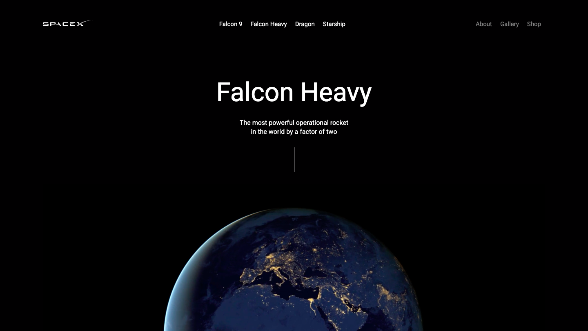

# SpaceX Interactive Website 🚀

An interactive landing page for SpaceX's Falcon Heavy rocket featuring smooth scroll animations, parallax effects, and video backgrounds. Built with HTML5, CSS3, and JavaScript using AOS library for animations, Rellax.js for parallax scrolling, and Vidbg.js for dynamic video backgrounds. The site is fully responsive across all devices with modern space-themed design.

Simply open `index.html` in your browser to view the website. The page includes animated navigation, hero section, technical specifications table, and interactive rocket image with parallax effects. All animations are optimized for performance and automatically adjust for mobile devices.

## 📸 Demo

